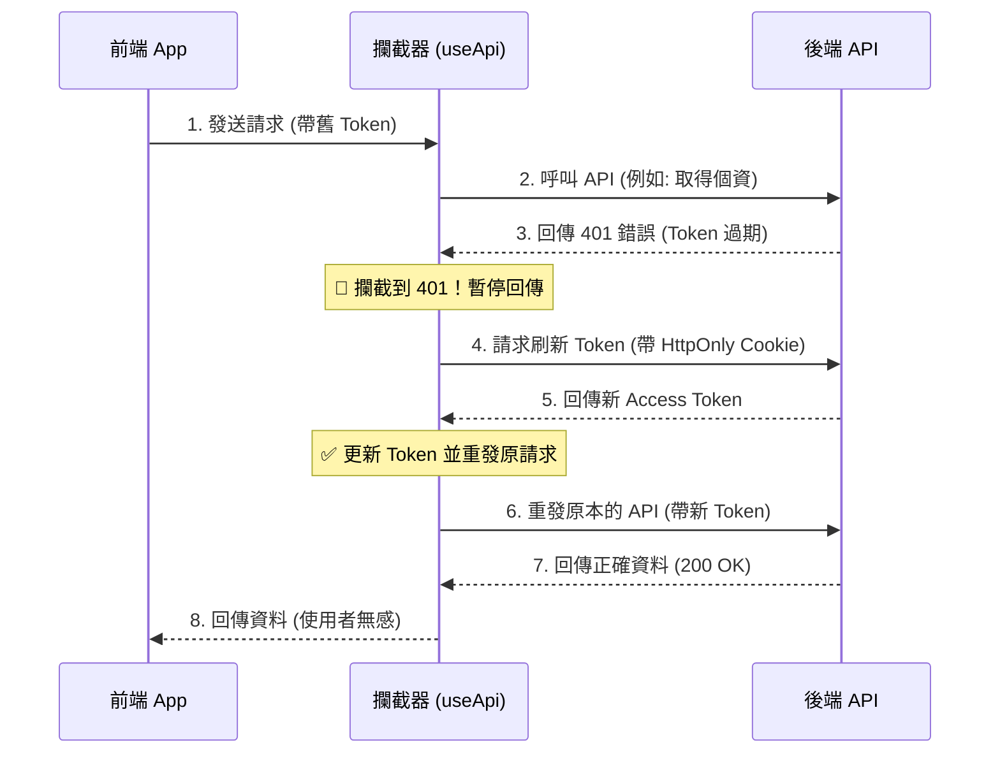

[← 返回 README.md](../../README.md)

# 認證與權限管理 (Authentication & Permissions)

關於 Token (通常是 JWT) 的處理，前端工程師最常面臨的挑戰是：**「要存哪裡？」** 與 **「過期了怎麼辦？」**。

## 1. Token 存哪裡？ (儲存策略)

這是一個沒有絕對標準答案，但有「相對安全」的選擇。

| 儲存方式              | 安全性 | XSS 風險          | CSRF 風險      | SSR 支援 | 推薦度            |
| :-------------------- | :----- | :---------------- | :------------- | :------- | :---------------- |
| **LocalStorage**      | 低     | 🔴 高 (JS 可讀取) | 🟢 無          | 🔴 無法  | ❌ 不推薦         |
| **Cookie (一般)**     | 中     | 🔴 高 (JS 可讀取) | 🟡 中          | 🟢 可    | ⚠️ 普通           |
| **Cookie (HttpOnly)** | 高     | 🟢 低 (JS 讀不到) | 🔴 高 (需防護) | 🟢 可    | ✅ **最推薦**     |
| **In-Memory (變數)**  | 最高   | 🟢 無             | 🟢 無          | 🔴 無法  | ⚠️ 僅限極高敏資料 |

### 🏆 最佳實踐：雙 Token 機制

最主流且安全的做法是結合 **短效存取權杖 (Access Token)** 與 **長效刷新權杖 (Refresh Token)**。

1.  **Access Token (短效)**：
    - 效期短 (例如 15 分鐘)。
    - 放在 **In-Memory (變數)** 或 **一般 Cookie** (為了方便前端判斷登入狀態)。
    - 用來發送 API 請求。
2.  **Refresh Token (長效)**：
    - 效期長 (例如 7 天)。
    - **必須** 放在 **HttpOnly Cookie** (前端 JS 讀不到，只有後端能讀)。
    - 用來換取新的 Access Token。

---

## 2. 如何實作「無感換發 Token」

這是前端工程最核心的實作細節。當 Access Token 過期時，使用者不應該被踢出登入頁，而是系統自動在背景換發新的 Token。

### 實作邏輯 (在 `useApi.ts` 中)

我們利用 `onResponseError` (401 錯誤) 來攔截。



### 程式碼範例 (`composables/useApi.ts`)

```typescript
// 是否正在換發 Token 的鎖 (避免同時發出多個 refresh 請求)
let isRefreshing = false
// 等待重發的請求隊列
let refreshQueue: Function[] = []

export function useApi(url, options = {}) {
  return useFetch(url, {
    ...options,

    async onResponseError({ response, options: retryOptions }) {
      // 如果收到 401 (未授權)
      if (response.status === 401) {
        // 1. 如果還沒開始換發，就發送換發請求
        if (!isRefreshing) {
          isRefreshing = true

          try {
            // 呼叫換發 API (這會自動帶上 HttpOnly Cookie)
            const { accessToken } = await $fetch('/api/auth/refresh', { method: 'POST' })

            // 更新前端的 Access Token
            const token = useCookie('auth_token')
            token.value = accessToken

            // 執行隊列中的請求
            refreshQueue.forEach((cb) => cb(accessToken))
            refreshQueue = []
          } catch (err) {
            // 換發失敗 (真的過期了)，登出並導向登入頁
            const token = useCookie('auth_token')
            token.value = null
            navigateTo('/login')
          } finally {
            isRefreshing = false
          }
        }

        // 2. 將原本失敗的請求加入隊列，等待換發成功後重試
        return new Promise((resolve) => {
          refreshQueue.push((newToken) => {
            // 更新 Header
            retryOptions.headers = {
              ...retryOptions.headers,
              Authorization: `Bearer ${newToken}`
            }
            // 重發請求
            resolve($fetch(response.url, retryOptions))
          })
        })
      }
    }
  })
}
```

## 3. 實戰：在專案中實作登入 (Implementation Guide)

根據我們目前的架構 (`$api` + `useApi`)，以下是完整的登入流程實作教學。

### 步驟一：準備登入 API

假設你已經用 `generate-module.js` 建立了一個 `auth` 模組，並在 `repositories/modules/auth.ts` 定義了登入方法：

```typescript
// repositories/modules/auth.ts
import { useApi } from '~/composables/useApi'

export default {
  login(credentials: any) {
    return useApi('/auth/login', {
      method: 'POST',
      body: credentials
    })
  }
}
```

### 步驟二：在登入頁面儲存 Token

在 `pages/login.vue` 中，登入成功後，我們使用 Nuxt 的 `useCookie` 來儲存 Token。

> **注意**：這裡的 Cookie 名稱 `auth_token` 必須跟 `composables/useApi.ts` 裡讀取的名稱一樣！

```vue
<script setup lang="ts">
const { $api } = useNuxtApp()
const router = useRouter()

const form = reactive({ username: '', password: '' })

async function handleLogin() {
  try {
    // 1. 呼叫 API
    const { data } = await $api.auth.login(form)

    // 2. 儲存 Token 到 Cookie (關鍵步驟！)
    // useApi 會自動讀取這個 Cookie
    const token = useCookie('auth_token', {
      maxAge: 60 * 60 * 24 * 7 // 7 天過期
    })
    token.value = data.value.accessToken

    // 3. 導向首頁
    router.push('/')
  } catch (error) {
    alert('登入失敗')
  }
}
</script>
```

### 步驟三：驗證是否生效

一旦 `token.value` 被設定了，下次你呼叫任何 API (例如 `$api.user.getUsers()`)：

1.  `useApi` 的 `onRequest` 攔截器會執行。
2.  它會執行 `useCookie('auth_token')` 抓到你剛剛存的 Token。
3.  它會自動把 Header 設定為 `Authorization: Bearer <你的Token>`。

**結論**：你只需要負責 **「登入時存 Cookie」** 和 **「登出時清 Cookie」**，剩下的 API 帶 Token 動作都是自動的！

---

## 4. 總結

1.  **不要把敏感資料存在 LocalStorage**。
2.  **Access Token** 可以放 Cookie (方便)，但 **Refresh Token** 一定要 HttpOnly。
3.  實作 **401 Interceptor** 來達成無感換證，提升使用者體驗。
